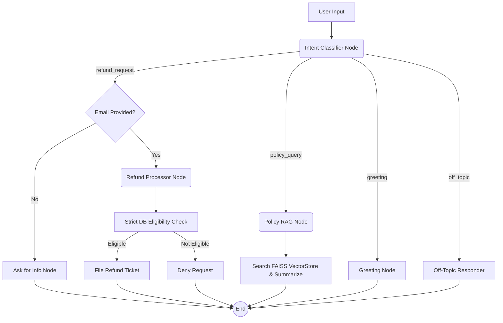

# AI Refund Assistant: A Deep Dive into LangGraph & Deterministic AI

Welcome to the **AI Refund Assistant** repository. This project is a fully functional web application demonstrating how to build a reliable AI Customer Support Agent that processes or denies e-commerce refunds. 

Unlike traditional "ReAct" agents that are prone to hallucinating API calls or policies, this project uses **LangGraph** to construct a deterministic state machine. It combines Large Language Models (LLMs) for intent understanding with strict Python logic for policy enforcement and database modifications.

---

## 🌟 Core Architecture & Pipeline

This project is divided into four main layers:

1. **Frontend (Next.js)**: 
   - A customer chat interface supporting text and voice.
   - An Admin Dashboard that displays real-time agent reasoning logs (intent, active email, selected order ID).
2. **Backend (FastAPI)**: 
   - Exposes a stateful WebSocket endpoint (`ws://localhost:8000/ws/{session_id}`) to maintain conversation history and stream real-time state updates to the UI.
   - Exposes REST API endpoints (`/api/transcribe` and `/api/tts`) for the voice pipeline.
3. **Agent Orchestration (LangGraph)**: 
   - A directed state graph that maps user intent to isolated nodes.
   - **Primary Model**: Uses `meta-llama/llama-4-scout-17b-16e-instruct` for natural language generation and tool extraction.
   - **Classifier Model**: Uses a fast, specialized `qwen/qwen3-32b` for rapid intent classification.
4. **Data Layer (SQLite & FAISS)**: 
   - **SQLite**: A mock CRM holding tables for `customers`, `items`, `orders`, and `support_tickets`.
   - **FAISS VectorStore**: A Retrieval-Augmented Generation (RAG) index built from official return policy documents.

---

## 🔄 LangGraph State Machine

The core philosophy of this agent is **Deterministic Routing**. Instead of letting the LLM decide which tools to run in a loop, every message is explicitly routed based on its intent.



### 🧠 Reasoning Logs & How Decisions Are Made

1. **Intent Classification & Entity Extraction (`qwen/qwen3-32b`)**:
   Every message first passes through the `classifier` node. This uses a structured output LLM to output a JSON object containing the `intent`, `customer_email`, and `current_order_id`. 
   
2. **Routing Logic**:
   The LangGraph checks the `intent`. If a user asks about the weather (`off_topic`), they are immediately routed to the `Off-Topic Responder`, completely bypassing the database and RAG tools to save tokens and prevent hallucinations.

3. **Refund Processor (Dynamic RAG Evaluator)**:
   When processing a refund request, the agent dynamically evaluates eligibility by combining RAG with database facts. It extracts the exact user issue, queries the **FAISS VectorStore** for the official policy, and passes those rules along with SQLite database facts (delivery date, item tag) into an LLM. The LLM outputs a strict JSON evaluation (`is_eligible`, `ticket_type`), and final Python guardrails ensure the ticket matches database constraints without hallucination loops.

4. **Real-Time State Sync**:
   The FastAPI backend uses `await websocket.send_json({"type": "state_update", ...})` to push the exact internal tracking variables (intent, email, order ID) to the Next.js Admin Dashboard instantly.

---

## 🎙️ The Voice Pipeline (`src/voice`)

This repository also features a built-in voice pipeline for live spoken interactions:

- **Speech-to-Text (STT)**: 
  - Located in `src/voice/stt.py`
  - Endpoint: `POST /api/transcribe`
  - Uses the **Groq API** running the `whisper-large-v3` model. Audio recordings from the frontend are temporarily saved as `.webm` and transcribed with a temperature of `0.0` to ensure exact factual translation.
- **Text-to-Speech (TTS)**: 
  - Located in `src/voice/tts.py`
  - Endpoint: `POST /api/tts`
  - Uses the `edge-tts` Python library to generate high-quality voice responses natively without requiring a paid TTS API key.

---

## 📂 Codebase Walkthrough

To understand the repo, review the files in this order:

```text
ai_refund_assistant/
├── api.py                        # (1) FastAPI entry point: handles WebSockets & routes
│
├── scripts/                      # Setup and initialization scripts
│   ├── build_rag.py              # Script to parse policy_docs/ and build FAISS index
│   ├── generate_mock_csv_data.py # Script to generate random Indian mock CRM data
│   ├── csv_to_sqlite.py          # Script to ingest CSV data into the SQLite database
│   └── test_db.py                # Script to verify the database
│
├── src/                          
│   ├── agent/                    # (2) Core LangGraph Agent Logic
│   │   ├── agent.py              # The graph definition and node routing
│   │   ├── guardrails.py         # Intent classifier and state schema
│   │   ├── refund_processor.py   # Strict eligibility checks & ticket filing logic
│   │   └── tools.py              # Tool definitions for RAG and DB operations
│   │
│   ├── voice/                    # (3) Voice Pipeline
│   │   ├── stt.py                # Whisper STT integration via Groq
│   │   └── tts.py                # Edge-TTS Text-to-Speech generation
│   │
│   ├── db/                       # (4) SQLite database operations
│   │   └── db_service.py         # SQL queries for fetching/updating orders
│   │
│   └── rag/                      # (5) Retrieval Augmented Generation
│       ├── data_loader.py        # PDF/Markdown parsing for policy docs
│       ├── embedding.py          # SentenceTransformer embedding wrapper
│       └── vectorstore.py        # Custom FAISS vector store implementation
│
├── frontend/                     # (6) Next.js Web App (Chat UI + Admin Dash)
├── db/                           # Generated SQLite DB & CSV raw data
└── policy_docs/                  # PDF/MD files detailing return rules
```

---

## 🚀 How to Run Locally

Follow these step-by-step instructions to initialize the databases and run the full stack.

### 1. Environment Setup
You need Python 3.10+ and Node.js installed.
Create a `.env` file in the root directory:
```env
GROQ_API_KEY=your_groq_api_key_here
MODEL_NAME=meta-llama/llama-4-scout-17b-16e-instruct
```
*(Note: Qwen is hardcoded in the codebase for fast intent classification; `MODEL_NAME` defines the primary LLM used for extraction and responses).*

### 2. Install Python Dependencies
```bash
pip install -r requirements.txt
```

### 3. Generate Mock Data & Initialize SQLite DB
You can either generate your own mock data using the script, or provide your own real data by replacing the CSV files in `db/csv_data`.
```bash
python scripts/generate_mock_csv_data.py
python scripts/csv_to_sqlite.py
```
*(This generates 15 Indian customer profiles, various e-commerce items, 250 orders, and mock support tickets).*

### 4. Build the FAISS VectorStore
Parse the PDFs and markdown files in `policy_docs/`. **Note**: You can add your own return/refund policy documents into the `policy_docs/` folder. By default, this repository uses the Amazon return documents as an example.
```bash
python scripts/build_rag.py
```

### 5. Start the FastAPI Backend
```bash
python api.py
```
*(The WebSocket endpoint runs at `ws://localhost:8000/ws/{session_id}` and the API runs at `http://localhost:8000`)*

### 6. Start the Next.js Frontend
Open a new terminal window:
```bash
cd frontend
npm install
npm run dev
```
Open [http://localhost:3000](http://localhost:3000) to interact with the AI Refund Assistant!
